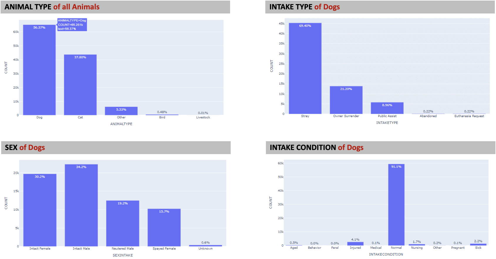
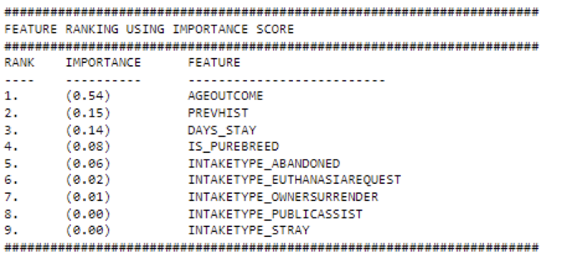
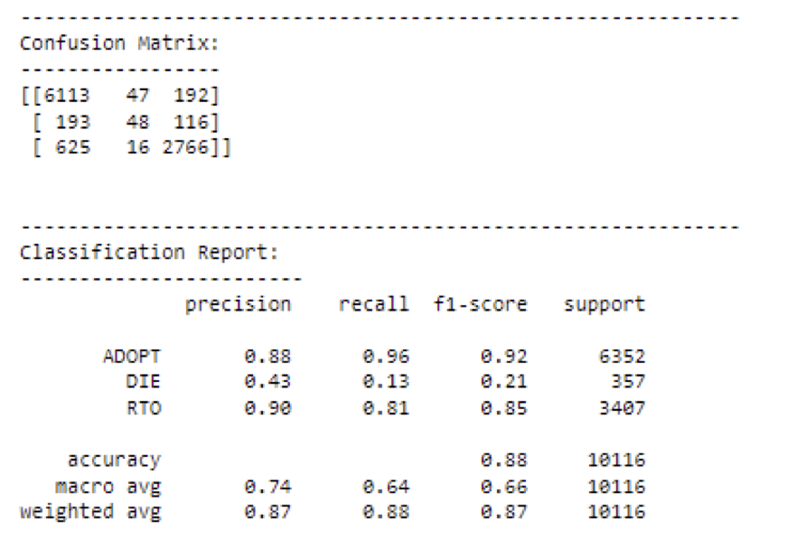
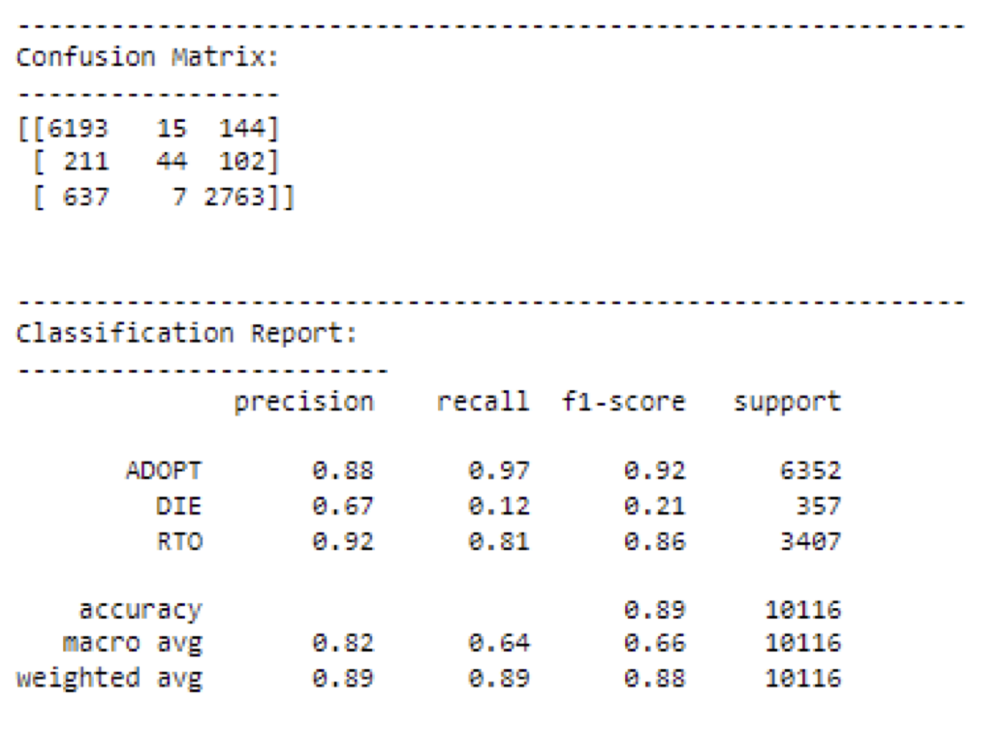
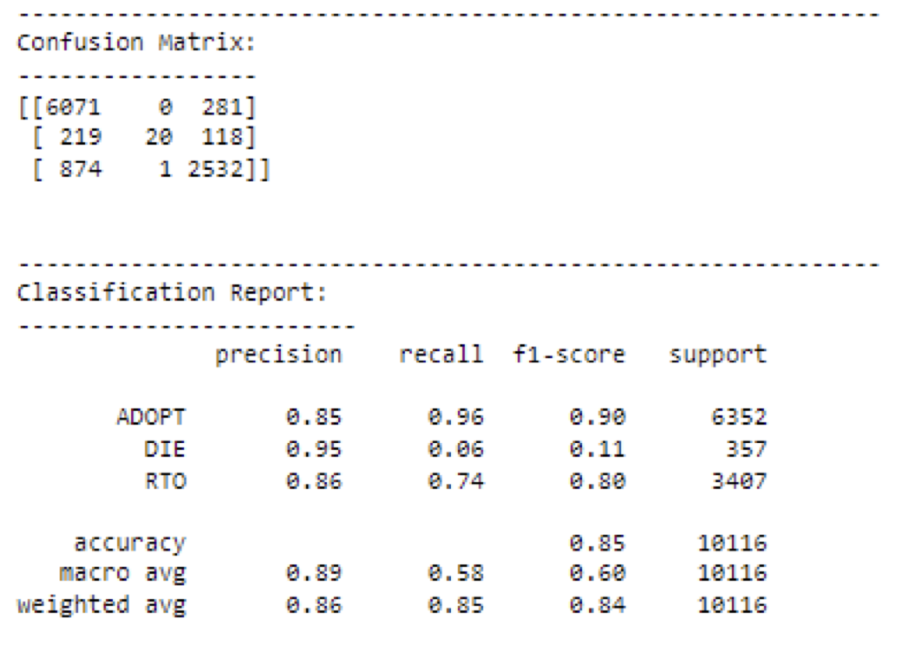
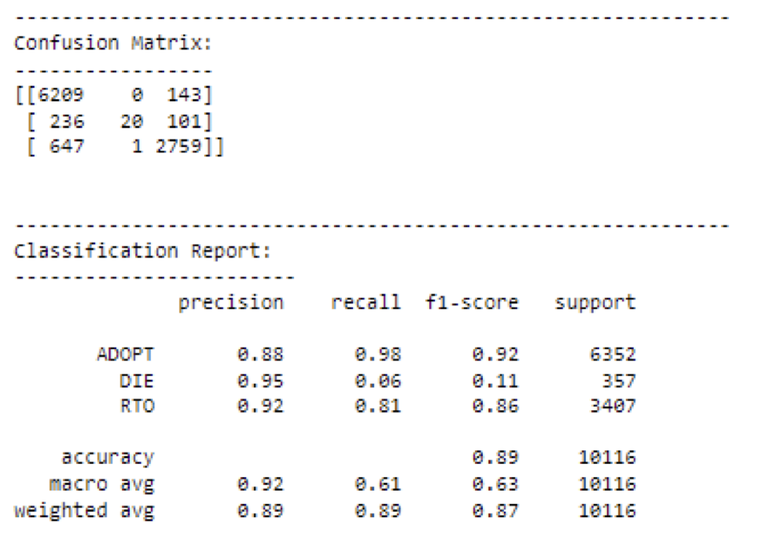

# SC1015_A136_T2_Mini-Project

## Introduction

For our mini project in the Introduction to Data Science and Artificial Intelligence module (SC1015), we performed analysis on the data from the Austin Animal Center Shelter Intakes and Outcomes dataset which were collected and made available by the Animal Services of Austin, Texas from Kaggle. We have chosen this particular problem as shelters would be able to identify animals that may be at higher risk of negative outcomes and develop strategies to increase their welfare and learn how to allocate their limited resources. Thus, our project would be highly essential for animal shelters.

## Problem Definition

- How can we predict the outcomes of animals in shelters based on their features?
- Which Animals are highly likely to end up in these shelters?
- Do the features or conditions at which the animal is taken into the shelter matter in its outcome? If so, which of these features are the most probable reason for so?

## Members (A136 Team 2)

- Tai Chee Hian
- Rhea Susan George
- S Dhanusha

## Files Included
- Data
  - _intakes.csv_ 
  - _outcomes.csv_ 
  - _stray_map.csv_
- _SC1015 Slides.pdf_ - presentation slides for our project
- _ EDA.ipynb_
-_Features.csv_
  - Cleaning and preparation
  - Basic visualisation
  - Exploratory data analysis
- Machine Learning
  - _Random Forest.ipynb_
  - _GradientBoosting.ipynb_
  - _SVM.ipynb_
  - _EnsembleModel.ipynb_

## Exploratory Data Analysis

### Data Cleaning and Transformation:

1. We first standardised the column names.

2. Since data is imported from CSV, datetime columns are in string formats so they need to be encoded into Datetime objects.

   - DATETIME_INTAKE
   - DATETIME_OUTCOME

3. AGE_INTAKE and AGE_OUTCOME in the raw format are encoded in string as -1 years; 1 year; 1 month; 4 weeks; 3 years; 2 months. This had to be transformed to numeric value and standardised as the number of months using the custom function _ConvertAgeAsMonths_.

4. Records or rows that have invalid data are removed.

   - DATETIME_INTAKE > DATETIME_OUTCOME
   - Negative values in AGE_INTAKE & AGE_OUTCOME

5. We added two features

   - PREVHIST: This shows how many times an animal was brought into the shelter – to identify serial runaways.
   - DAYS_STAY: This is the difference between DATETIME_OUTCOME and DATETIME_INTAKE.

6. Merge the intakes file with outcome file records by chronologically matching intakes records with outcome records of the same animal. We use ANIMALID and PREVHIST to merge both data sets to form a data frame dfAnimal.

### Analysis:

- Features and the highest classes:
  1. Animal Type → Dogs 56.37%
  2. Intake Type of Dogs → Stray 69.40%
  3. Sex of Dogs → Intact Male 34.20%
  4. Intake Condition of Dogs → Normal 91.1%

- Features that were too diverse:
  1. Breed of Dog: Used feature engineering to make it numerical for easier analysis
  2. Colour of Dog: Fundamentally, colour not very important, therefore feature is ignored

## Machine Learning

### Steps:

1. 20% of the data was randomly assigned for test, while the rest was used to train
2. Random Forest Classifier and test Feature Importance
3. Fine tune the feature set by removing features that are not important
4. Model using Random Forest Classifier ➔ RFC
5. Model using Gradient Boosting Algorithm ➔ GBM
6. Model using Support Vector Machines Classifier ➔ SVC
7. Create an Ensemble Model combining RFC, GBM and SVC

### Random Forest Classifier (RFC)

- Use the data to train the Random Forest model to recognize patterns in the data and make accurate predictions based on the features of the dog.
- More accurate and consistent than Decision Tree.
- Also helps test for feature importance and ranks them accordingly from most important feature to least
- Features that have low to no importance can be fine tuned and removed from feature set
- Accuracy : 88%

### Gradient Boosting Algorithm (GBM)

- It is a sequential ensemble learning technique where the performance of the model improves over iterations. This process continues until the model can no longer be improved.
- The model is trained to minimise the loss function.
- Achieved by computing the negative gradient of the loss function with respect to the predicted output.
- Accuracy: 89%

### Support Vector Machine (SVM)

- Supervised learning machine learning algorithm.
- Effective in high dimensional spaces.
- Accuracy: 85%

### Ensemble Model

- When all models are put together, the precision of each outcome improved.
- Overall accuracy: 89%

### Conclusion

- GBM has the best accuracy.
- SVM has the worst accuracy.
- Ensemble Model accuracy improved dramatically.

## What have we learnt from this project?

- Using feature engineering
- Using machine learning tools (RandomForest, Gradient Boosting, SVM) to obtain accuracy of our prediction model.

## References

- https://www.aspca.org/helping-people-pets/shelter-intake-and-surrender/pet-statistics
